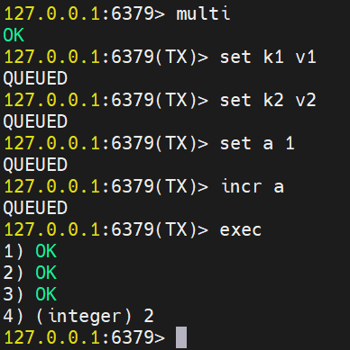
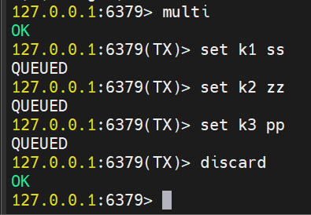
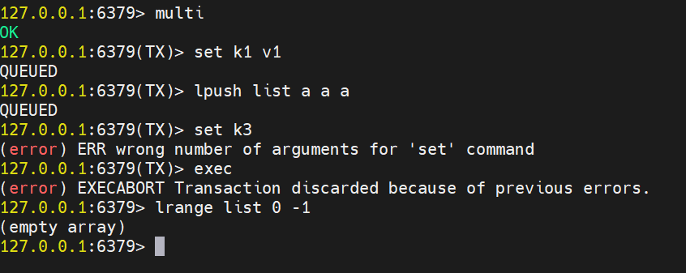
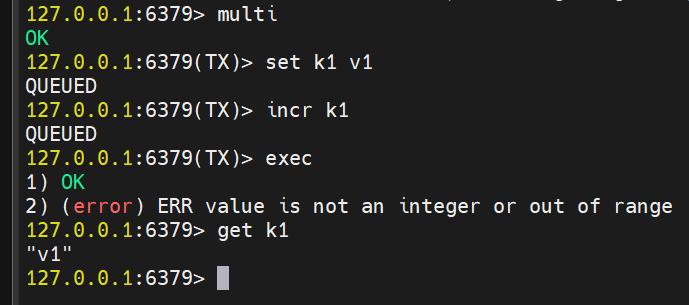

### Redis事务


#### 介绍
 可以一次执行多个命令，本质是一组命令的集合。一个事务中的所有命令都会序列化， 按顺序地串行化执行而不会被其他命令插入，不许加塞
一个队列中，一次性、顺序性、排他性的执行一系列命令


#### Redis事务和数据库事务
1. 单独的隔离操作Redis的事务仅仅是保证事务里的操作会被连续独占的执行，redis命令执行是单线程架构，在执行完事务内所有指令前是不可能再去同时执行其他客户端的请求的
2. 没有隔离级别的概念因为事务提交前任何指令都不会被实际执行，也就不存在”事务内的查询要看到事务里的更新，在事务外查询不能看到这种问题了
3. 不保证原子性Redis的事务不保证原子性，也，就是不保证所有指令同时成功或同时失败，只有决定是否开始执行全部指令的能力，没有执行到一半进行回滚的能力
4. 排它性Redis会保证一个事务内的命令依次执行，而不会被其它命令插入

#### 4个案例

1. 正常执行

   ```  java 
   MULTI   // 事务开始
   EXEC    // 执行事务

   ```
   

2. 放弃事务
    ``` java
    MULTI     // 事务开始
    DISCARD   // 放弃事务

    ```

    


3. 全体连坐

    ```  java 

    MULTI   // 事务开始
    // 写错某句指令 ， 编译都不过关
    EXEC    // 执行事务
    // 指令全部执行失败
    ```

    


4. 冤头债主

    ```  java 

    MULTI   // 事务开始
    // 写错某句指令 ， 但编译过关 
    EXEC    // 执行事务
    // 指令写错的不成功 ，其他都成功。
    ```

    


#### watch监控
1. 介绍
    - Redis使用Watch 来提供乐观锁定，类似于 CAS（Check-and-Set）
      - 悲观锁 
        >认为每次去拿数据都很认为别人会修改，所以每次拿数据的时候都会上锁，这样别人想拿这个数据就会block直到它拿到锁
      - 乐观锁
        >1. 认为每次去拿数据的时候都认为别人不会修改，所以不会上锁，但是在更新的时候会判断一下在此期间别人有没有去更新这个数据
        >2. 提交版本必须 大于 记录当前版本才能执行更新
      - CAS
        >check-and-set（JUC中CAS操作相似）


1. 基本指令
   ``` java
    watch key   // 开启对key的监控
    unwatch     // 放弃监控 
   ```
