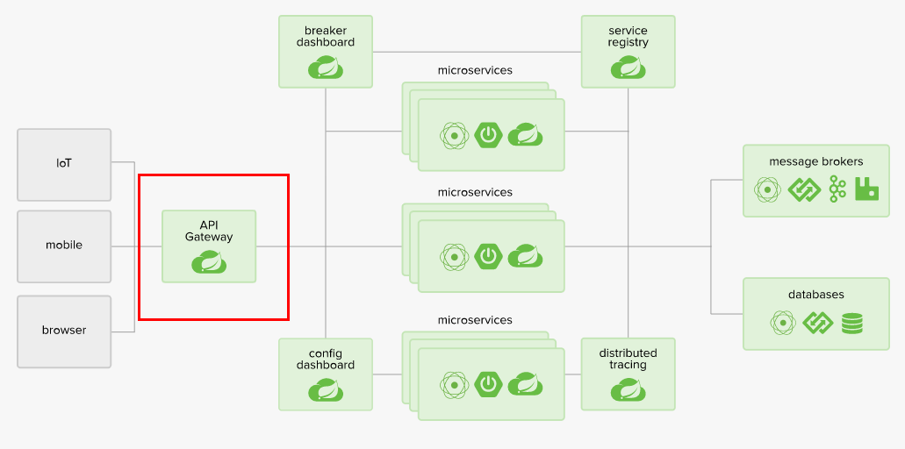
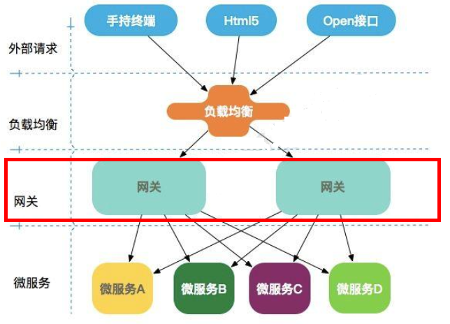
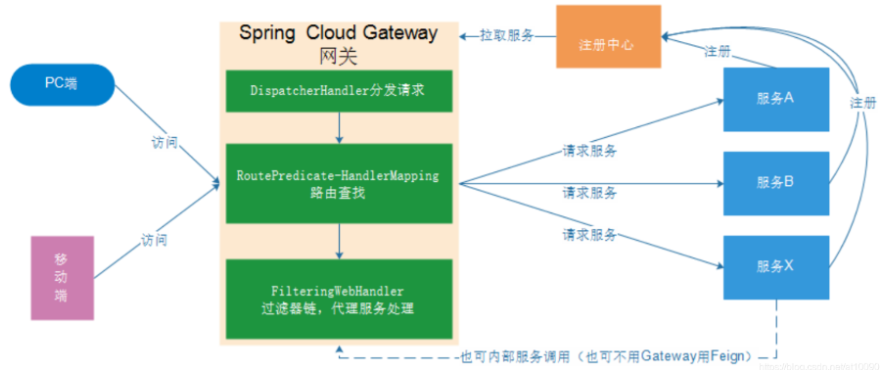
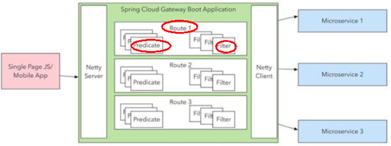
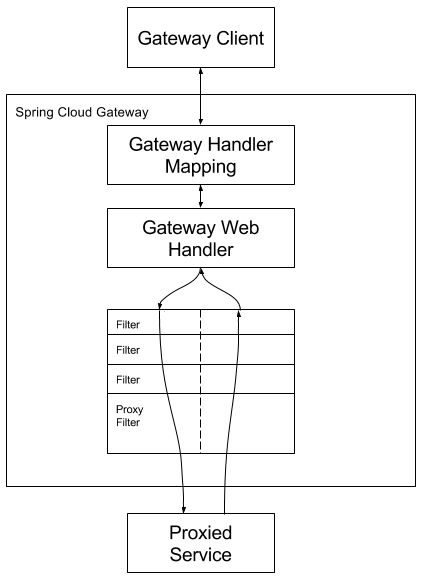

### 介绍
[官网](https://spring.io/projects/spring-cloud-gateway)

>Cloud全家桶中有个很重要的组件就是网关，在1.x版本中都是采用的Zuul网关；<br>
>但在2.x版本中，zuul的升级一直跳票，SpringCloud最后自己研发了一个网关SpringCloud Gateway替代Zuul，
>那就是SpringCloud Gateway一句话：gateway是原zuul1.x版的替代



#### 微服务中网关的位置


#### 能干嘛
- 方向代理
- 鉴权
- 流量控制
- 熔断
- 日志监控
#### 总结
Spring Cloud Gateway组件的核心是一系列的过滤器，通过这些过滤器可以将客户端发送的请求转发(路由)到对应的微服务。 Spring Cloud Gateway是加在整个微服务最前沿的防火墙和代理器，隐藏微服务结点IP端口信息，从而加强安全保护。Spring Cloud Gateway本身也是一个微服务，需要注册进服务注册中心。


### 三大核心
1. Router(路由)
   
    路由是构建网关的基本模块，它由D,目标UR!,一系列的断言和过滤器组成，如果断言为tue则匹配该路由

2. Predicate(断言)

    参考的是Java8的java.util.function.Predicate开发人员可以匹配HTTP请求中的所有内容（例如请求头或请求参数），如果请求与断言相匹配则进行路由
3. Filter(过滤)
   
   指的是Spring?框架中GatewayFilter的实例，使用过滤器，可以在请求被路由前或者之后对请求进行修改。
#### 总结


web前端请求，通过一些匹配条件，定位到真正的服务节点。并在这个转发过程的前后，进行一些精细化控制。

predicate就是我们的匹配条件；

filter，就可以理解为一个无所不能的拦截器。有了这两个元素，再加上目标uri，就可以实现一个具体的路由了

### 工作流程



客户端向 Spring Cloud Gateway 发出请求。然后在 Gateway Handler Mapping 中找到与请求相匹配的路由，将其发送到 Gateway Web Handler。Handler 再通过指定的过滤器链来将请求发送到我们实际的服务执行业务逻辑，然后返回。
过滤器之间用虚线分开是因为过滤器可能会在发送代理请求之前(Pre)或之后(Post)执行业务逻辑。
在“pre”类型的过滤器可以做参数校验、权限校验、流量监控、日志输出、协议转换等;
在“post”类型的过滤器中可以做响应内容、响应头的修改，日志的输出，流量监控等有着非常重要的作用。

### 简单配置
1. maven包导入
    ``` xml
    <!--gateway-->
    <dependency>
        <groupId>org.springframework.cloud</groupId>
        <artifactId>spring-cloud-starter-gateway</artifactId>
    </dependency>
    <!--服务注册发现consul discovery,网关也要注册进服务注册中心统一管控-->
    <dependency>
        <groupId>org.springframework.cloud</groupId>
        <artifactId>spring-cloud-starter-consul-discovery</artifactId>
    </dependency>
    <!-- 指标监控健康检查的actuator,网关是响应式编程删除掉spring-boot-starter-web dependency-->
    <dependency>
        <groupId>org.springframework.boot</groupId>
        <artifactId>spring-boot-starter-actuator</artifactId>
    </dependency>
    ```
2. application.yml 
   > **源码配置**<br>
   > `org.springframework.cloud.gateway.config.GatewayProperties`
   > ``` java     
   > public static final String PREFIX = "spring.cloud.gateway";
   > private final Log logger = LogFactory.getLog(this.getClass());
   > private @NotNull @Valid List<RouteDefinition> routes = new ArrayList();
   > private List<FilterDefinition> defaultFilters = new ArrayList();
   > private List<MediaType> streamingMediaTypes;
   > private boolean failOnRouteDefinitionError; 
   > ```
   ``` yaml
    server:
      port: 8088
    spring:
      application:
        name: cloud-gateway #以微服务注册进consul或nacos服务列表内
      cloud:
        consul: #配置consul地址
          host: localhost
          port: 8500
          discovery:
            prefer-ip-address: true
            service-name: ${spring.application.name}
        gateway:
          routes:
            - id: pay_routh1 #pay_routh1                #路由的ID(类似mysql主键ID)，没有固定规则但要求唯一，建议配合服务名
             uri: http://localhost:8001                #匹配后提供服务的路由地址
             predicates:
              - Path=/pay/gateway/get/**              # 断言，路径相匹配的进行路由
            - id: pay_routh2 #pay_routh2                #路由的ID(类似mysql主键ID)，没有固定规则但要求唯一，建议配合服务名
              uri:  lb://cloud-payment-service                #匹配后提供服务的路由地址
              predicates:
                - Path=/pay/gateway/info/**              # 断言，路径相匹配的进行路由
                - After=2017-01-20T17:42:47.789-07:00[America/Denver] # 在某时间后
                - Before=2017-01-20T17:42:47.789-07:00[America/Denver] # 在某时间前
                - Between=2017-01-20T17:42:47.789-07:00[America/Denver], 2017-01-21T17:42:47.789-07:00[America/Denver] # 在某某间
                - Cookie=cookiename, regexp  # Cookie携带 cookiename 和 匹配的正则规则
                - Header=X-Request-Id, \d+   # 请求头携带某某
                - Host=**.somehost.org,**.anotherhost.org  # 主机列表 数组
                - Method=GET,POST  # 请求的方法
                - Query=green   #  表示请求携带的 参数 包含green
                - Query=red, red*   #  请求携带的参数 和 正则表达式
                - RemoteAddr=192.168.1.1/24  # 请求的远程地址
              filters:
                # 1. 针对请求头的 
                # 1.1 Request
                - AddRequestHeader=name, value  # 如果请求头不存在 添加进入请求头 存在用原来请求的值
                -- AddRequestHeadersIfNotPresent=X-Request-Color-1:blue,X-Request-Color-2:green  # 可批量添加
                - RemoveRequestHeader=sec-fetch-site      # 删除请求头sec-fetch-site
                - SetRequestHeader=sec-fetch-mode, Blue-updatebyzzyy # 将请求头sec-fetch-mode对应的值修改为Blue-updatebyzzyy
                # 1.2 Response
                - SetResponseHeader=Date,2099-11-11 # 设置回应头Date值为2099-11-11
                - RemoveResponseHeader=Content-Type # 将默认自带Content-Type回应属性删除
                - AddResponseHeader=X-Response-Red, Blue
                # 2. 请求参数
                - AddRequestParameter=red, blue  # 添加请求参数
                - RemoveRequestParameter=customerName   # 删除url请求参数customerName，你传递过来也是null
                # 3. 请求路径
                - PrefixPath=/pay # http://localhost:9527/pay/gateway/filter
                - SetPath=/pay/gateway/{segment}  # {segment}表示占位符，你写abc也行但要上下一致
                - RedirectTo=302, http://www.atguigu.com/ # 访问http://localhost:9527/pay/gateway/filter跳转到http://www.atguigu.com/
          default-filter:
            # 跟filter 有相同的配置

   ```
  >更多路由谓词配置 [官网谓词工厂](https://docs.spring.io/spring-cloud-gateway/reference/4.1-SNAPSHOT/spring-cloud-gateway/request-predicates-factories.html) 


### 自定义配置

#### 自定义Predicate 规则
1. 部分源码分析
  ``` java
  // 1. 形如 这种的XXXRoutePredicateFactory implementation PredicateFactory 会被注册进入ioc容器
  // org.springframework.cloud.gateway.handler.predicate.BeforeRoutePredicateFactory  源头

  // 2. 注册进入后 GatewayLegacyControllerEndpoint 拿到 所有的 PredicateFactory 并进入谓词匹配规则
  package org.springframework.cloud.gateway.config;
  class GatewayAutoConfiguration{
      @Bean
      @Conditional({OnVerboseDisabledCondition.class})
      @ConditionalOnAvailableEndpoint
      public GatewayLegacyControllerEndpoint gatewayLegacyControllerEndpoint(RouteDefinitionLocator routeDefinitionLocator, List<GlobalFilter> globalFilters, List<GatewayFilterFactory> gatewayFilters, List<RoutePredicateFactory> routePredicates, RouteDefinitionWriter routeDefinitionWriter, RouteLocator routeLocator, WebEndpointProperties webEndpointProperties) {
          return new GatewayLegacyControllerEndpoint(routeDefinitionLocator, globalFilters, gatewayFilters, routePredicates, routeDefinitionWriter, routeLocator, webEndpointProperties);
      }
  }
  // 3. 通过配置的谓词规则 和 routePredicate.name() 判断想不一不一样确定 匹配规则
  package org.springframework.cloud.gateway.actuate;
  class AbstractGatewayControllerEndpoint{
      private boolean isAvailable(PredicateDefinition predicateDefinition) {
          return this.routePredicates.stream().anyMatch((routePredicate) -> {
              return predicateDefinition.getName().equals(routePredicate.name());
          });
      }
  }

  package org.springframework.cloud.gateway.handler.predicate;
  class RoutePredicateFactory{
    default String name() {
          return NameUtils.normalizeFilterFactoryName(this.getClass());
      }
  }

  //    
  class NameUtils{
      public static String normalizeFilterFactoryName(Class<? extends GatewayFilterFactory> clazz) {
        return removeGarbage(clazz.getSimpleName().replace(GatewayFilterFactory.class.getSimpleName(), ""));
      }
      private static String removeGarbage(String s) {
        int garbageIdx = s.indexOf("$Mockito");
        return garbageIdx > 0 ? s.substring(0, garbageIdx) : s;
      }
  }
  ```

1. java代码
  ``` java


  import jakarta.validation.constraints.NotNull;
  import org.springframework.cloud.gateway.handler.predicate.AbstractRoutePredicateFactory;
  import org.springframework.http.server.reactive.ServerHttpRequest;
  import org.springframework.stereotype.Component;
  import org.springframework.util.MultiValueMap;
  import org.springframework.validation.annotation.Validated;
  import org.springframework.web.server.ServerWebExchange;
  import java.util.function.Predicate;
  import lombok.Getter;
  import lombok.Setter;

  @Component
  public class MyCustomRoutePredicateFactory extends AbstractRoutePredicateFactory<MyCustomRoutePredicateFactory.Config> {
      public MyCustomRoutePredicateFactory()
      {
          super(MyCustomRoutePredicateFactory.Config.class);
      }

      public MyCustomRoutePredicateFactory(Class<MyCustomRoutePredicateFactory.Config> configClass) {
          super(configClass);
      }
      public List<String> shortcutFieldOrder() {
          return Arrays.asList("username", "password");
      }
      @Override
      public Predicate<ServerWebExchange> apply(MyCustomRoutePredicateFactory.Config config) {
        return new Predicate<ServerWebExchange>() {
            @Override
            public boolean test(ServerWebExchange serverWebExchange) {
                ServerHttpRequest request = serverWebExchange.getRequest();
                MultiValueMap<String, String> queryParams = request.getQueryParams();
                String username = queryParams.getFirst("username");
                String password = queryParams.getFirst("password");;
                if(username == null || password == null)
                    return false;
                if(username.equals(config.getUsername()) && password.equals(config.getPassword())){
                    return true;
                }
                return false;
            }
        };
      }
      @Validated
      public static class Config {
          @NotNull
          @Getter
          @Setter
          private String username;
          @NotNull
          @Getter
          @Setter
          private String password;
      }
  }

  ```

3. application.yml配置
  ``` yaml
  spring.cloud.gateway.predicates:
    routes:
      id: 
      uri:
      predicates:
      # 没有 shortcutFieldOrder
        - name: MyCustom
          args:
            username:lei
            password:123
      # 有
      #- MyCustom=lei,123
  ```

4. 最佳实战
  1. 使用`XXXXRoutePredicateFactory` 继承 `AbstractRoutePredicateFactory` 加入`ioc`容器 
  2. 配置 yml 以 `XXXX` 为名称进行配置
#### 自定义全局Filter
``` java


import lombok.extern.slf4j.Slf4j;
import org.springframework.cloud.gateway.filter.GatewayFilterChain;
import org.springframework.cloud.gateway.filter.GlobalFilter;
import org.springframework.core.Ordered;
import org.springframework.stereotype.Component;
import org.springframework.web.server.ServerWebExchange;
import reactor.core.publisher.Mono;


@Component
@Slf4j
public class MyGlobalFilter implements GlobalFilter, Ordered
{

    /**
     * 数字越小优先级越高
     * @return
     */
    @Override
    public int getOrder()
    {
        return 0;
    }

    private static final String BEGIN_VISIT_TIME = "begin_visit_time";//开始访问时间
    /**
     *第2版，各种统计
     * @param exchange
     * @param chain
     * @return
     */
    @Override
    public Mono<Void> filter(ServerWebExchange exchange, GatewayFilterChain chain) {
        //先记录下访问接口的开始时间
        exchange.getAttributes().put(BEGIN_VISIT_TIME, System.currentTimeMillis());

        return chain.filter(exchange).then(Mono.fromRunnable(()->{
            Long beginVisitTime = exchange.getAttribute(BEGIN_VISIT_TIME);
            if (beginVisitTime != null){
                log.info("访问接口主机: " + exchange.getRequest().getURI().getHost());
                log.info("访问接口端口: " + exchange.getRequest().getURI().getPort());
                log.info("访问接口URL: " + exchange.getRequest().getURI().getPath());
                log.info("访问接口URL参数: " + exchange.getRequest().getURI().getRawQuery());
                log.info("访问接口时长: " + (System.currentTimeMillis() - beginVisitTime) + "ms");
                log.info("我是美丽分割线: ###################################################");
                System.out.println();
            }
        }));
    }

}

```

#### 自定义Filter规则
1. 原理实现步骤
   继承 AbstractGatewayFilterFactory<T> 源码解析同 **自定义Predicate**

2. java代码
  ``` java


  import lombok.Getter;
  import lombok.Setter;
  import org.springframework.cloud.gateway.filter.GatewayFilter;
  import org.springframework.cloud.gateway.filter.GatewayFilterChain;
  import org.springframework.cloud.gateway.filter.factory.AbstractGatewayFilterFactory;
  import org.springframework.http.HttpStatus;
  import org.springframework.http.server.reactive.ServerHttpRequest;
  import org.springframework.stereotype.Component;
  import org.springframework.web.server.ServerWebExchange;
  import reactor.core.publisher.Mono;

  import java.util.Arrays;
  import java.util.List;

  @Component
  public class MyCustomGatewayFilterFactory extends AbstractGatewayFilterFactory<MyCustomGatewayFilterFactory.Config> {
      public MyCustomGatewayFilterFactory() {
          super(MyCustomGatewayFilterFactory.Config.class);
      }


      @Override
      public GatewayFilter apply(MyCustomGatewayFilterFactory.Config config) {
          return new GatewayFilter() {
              @Override
              public Mono<Void> filter(ServerWebExchange exchange, GatewayFilterChain chain) {
                  ServerHttpRequest request = exchange.getRequest();
                  System.out.println("进入了自定义网关过滤器MyCustomGatewayFilterFactory，status：" + config.getStatus());
                  if (request.getQueryParams().containsKey("lxj")) {
                      return chain.filter(exchange);
                  } else {
                      exchange.getResponse().setStatusCode(HttpStatus.BAD_REQUEST);
                      return exchange.getResponse().setComplete();
                  }
              }
          };
      }

      @Override
      public List<String> shortcutFieldOrder() {
          return Arrays.asList("status");
      }

      public static class Config {
          @Getter
          @Setter
          private String status;//设定一个状态值/标志位，它等于多少，匹配和才可以访问
      }
  }


  ```
3. application 配置
   ``` yaml
  spring.cloud.gateway.predicates:
    routes:
      id: 
      uri:
      filters:
       - MyCustom=lxj
   ```
4. 最佳实战
  1. 使用`XXXXGatewayFilterFactory` 继承 `AbstractGatewayFilterFactory` 加入`ioc`容器 
  2. 配置 yml 以 `XXXX` 为名称进行配置