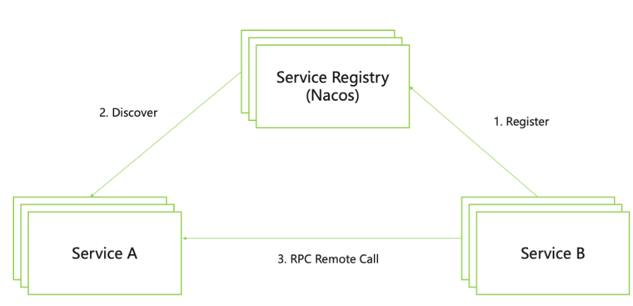
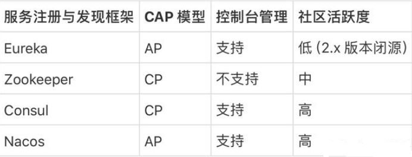
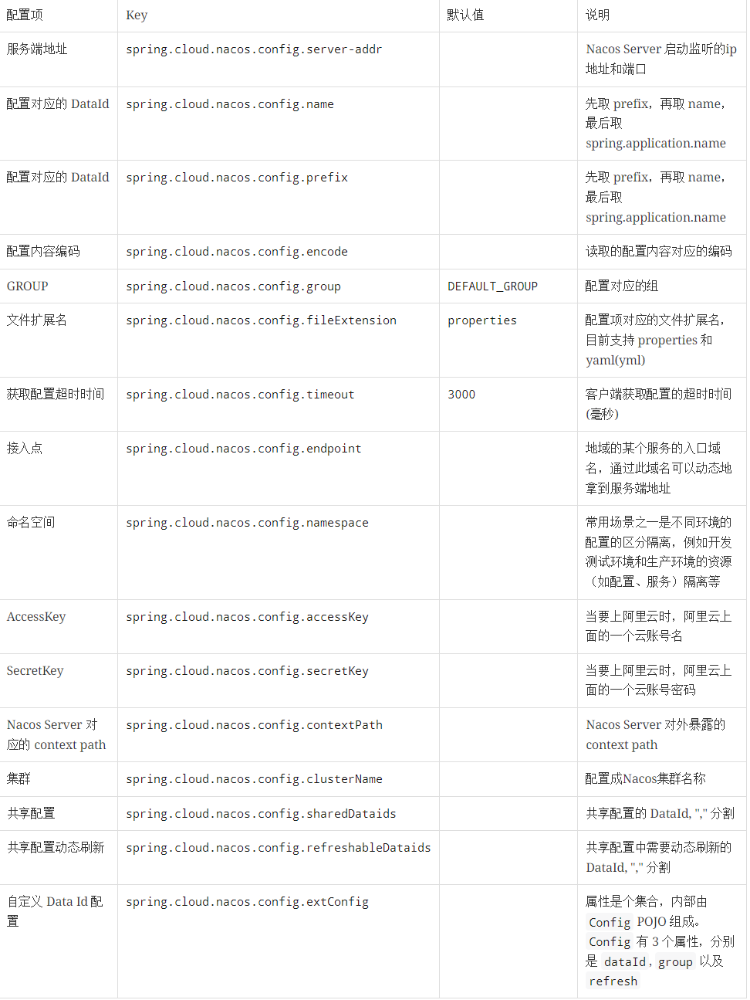
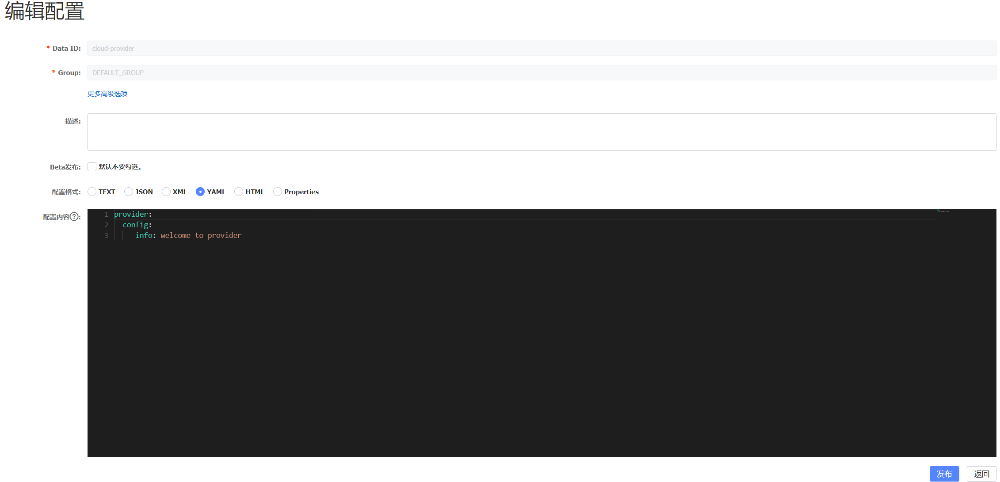

### 1服务注册 与 发现

在**单体架构**中一次独立的请求可以通过**方法调用**的形式直接进行响应。
但是根据 一个系统的功能完全可以按照该系统**粒度**拆分成多个系统单独部署，形成我们的微服务系统。
以便实现模块内的**高内聚**，模块间的**低耦合**，实现整个**微服务系统**的**高可扩展性**。
原来一次在一个应用内即可完成的请求处理，会出现跨进程跨主机的服务调用，如何让这个服务之间能互相发现像单体式应用一样提供统一对外的服务调用能力是微服务框架层面需要重点解决的核心问题之一。 在 Spring Cloud 生态中，采用了如下服务注册与发现模型，来实现微服务之间的互相发现与调用。



如上图所示，通过在微服务系统中引入一个叫做注册中心的组件，来作为协调者。其最简化的过程是，所有的微服务应用在启动过程中会将自身包含服务名称、主机 IP 地址和端口号等信息发送到注册中心中，然后上游的微服务在处理请求过程中，根据服务名称到注册中心中查找对应服务的所有实例 IP 地址和端口号来进行服务调用，整个过程如图中虚线所示。从而让分散的微服务系统之间能像一个整体一样对外提供请求处理能力。




### 2.实战
[spring-cloud-alibaba官网](https://sca.aliyun.com/)

>tip: 需要 先下载 nacos 并且运行
>[下载地址](https://nacos.io/download/nacos-server/)
>startup.cmd -m standalone 运行

#### 2.1 Spring Cloud Alibaba Nacos Discovery
1. 导入 spring-cloud-alibaba的依赖管理
   ``` xml
        <!--  具体版本 请查看 spring-cloud-alibaba官网   -->
        <properties>
         <spring-cloud.version>2022.0.0</spring-cloud.version>
            <spring-cloud-alibaba-dependencies.version>2022.0.0.0-RC2</spring-cloud-alibaba-dependencies.version>
        </properties>
        <dependencyManagement>
            <dependencies>
                <dependency>
                    <groupId>com.alibaba.cloud</groupId>
                    <artifactId>spring-cloud-alibaba-dependencies</artifactId>
                    <version>${spring-cloud-alibaba-dependencies.version}</version>
                    <type>pom</type>
                    <scope>import</scope>
                </dependency>
                <dependency>
                    <groupId>org.springframework.cloud</groupId>
                    <artifactId>spring-cloud-dependencies</artifactId>
                    <version>${spring-cloud.version}</version>
                    <type>pom</type>
                    <scope>import</scope>
                </dependency>
            </dependencies>
        </dependencyManagement>
   ```
2. 导入具体的 jar 包
   ``` xml
        <dependency>
            <groupId>com.alibaba.cloud</groupId>
            <artifactId>spring-cloud-starter-alibaba-nacos-discovery</artifactId>
        </dependency>
        <!--  消费者需要额外导入负载均衡的包   -->
        <dependency>
            <groupId>org.springframework.cloud</groupId>
            <artifactId>spring-cloud-starter-loadbalancer</artifactId>
        </dependency>
   ```
3. 更改配置文件
   ``` yaml
    spring:
        application:
            # 配置的 这name会当作他的 服务命
            name: cloud-provider
        cloud:
            nacos:
            discovery:
                server-addr: localhost:8848
                #username 和 password 不填可能报错
                username: nacos
                password: nacos
   ```
   更多配置

    

4. 测试
   
   http://localhost:8848/nacos


#### 2.2Spring Cloud Alibaba Nacos Config

1. java程序 导 jar 包
    管理包跟 2.1 保持一致
    ``` xml
    <dependency>
        <groupId>com.alibaba.cloud</groupId>
        <artifactId>spring-cloud-starter-alibaba-nacos-config</artifactId>
    </dependency>
    ```
2.  Nacos 服务器配置
    下图表示 DataId 使用cloud-provider, GROUP 使用 DEFAULT_GROUP，配置格式为 YAML 的一个配置项:

    

3. java程序 配置
    
    ``` txt
    spring.cloud.nacos.config.name 默认为 spring.application.name,所以DataId 为  spring.application.name。
    Nacos Config 在加载配置的时候，不仅仅加载了以 DataId 为 ${spring.application.name}.${file-extension:properties} 为前缀的基础配置，还加载了DataId为${spring.application.name}-${profile}.${file-extension:properties}的基础配置。在日常开发中如果遇到多套环境下的不同配置，可以通过Spring 提供的 ${spring.profiles.active} 这个配置项来配置。
    ```
   
   ``` yaml
    spring:
        application:
            name: cloud-provider
        cloud:
            nacos:
                config:
                    server-addr: localhost:8848
                    file-extension: yaml
                    username: nacos
                    password: nacos
                    name: cloud-provider
                    namespace: public
                    group: DEFAULT_GROUP
                    refresh
                        # 默认开启动态刷新
                        enabled: false
                discovery:
                    server-addr: localhost:8848
                    username: nacos
                    password: nacos

   ```
4. 关于关于 Nacos Config Starter 更多的配置项信息

    