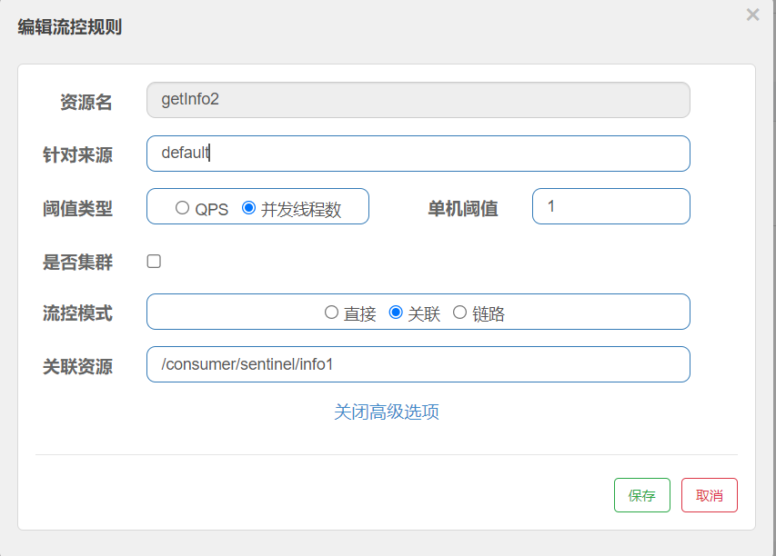
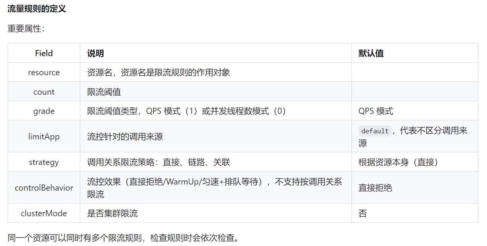
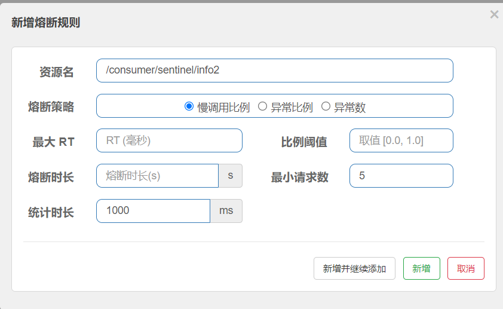
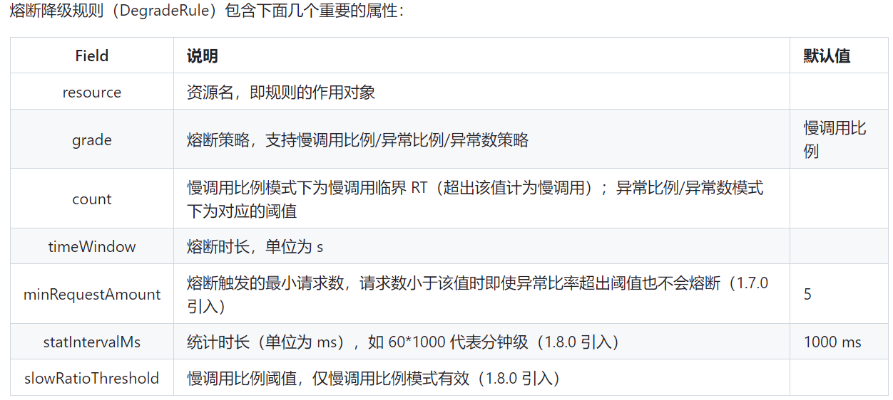
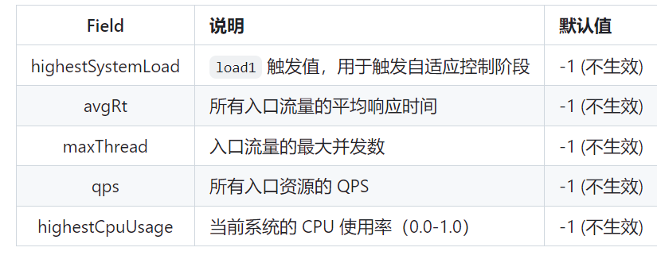
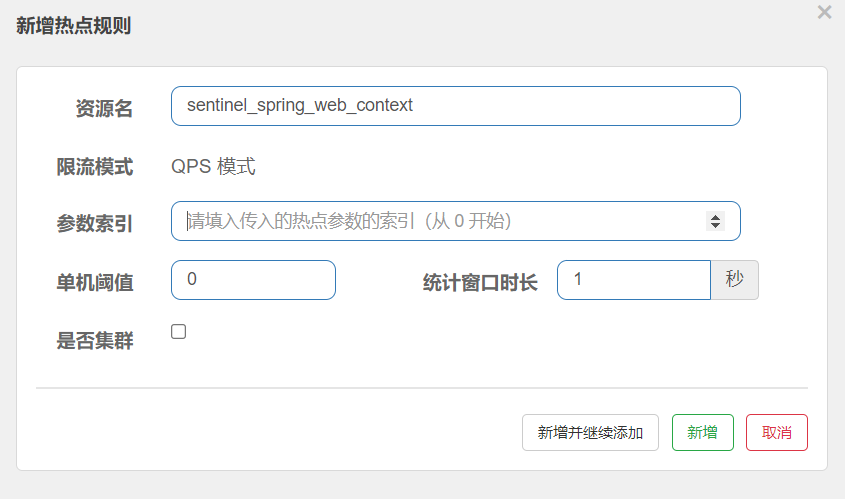
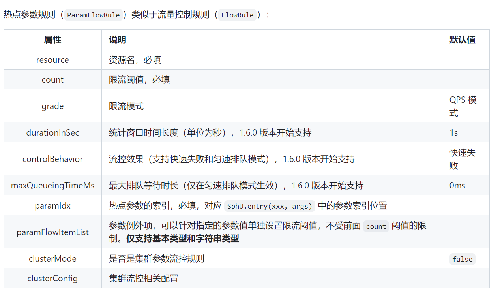

## Spring Cloud Alibaba Sentinel

### Sentinel介绍

随着微服务的流行，服务和服务之间的稳定性变得越来越重要。 [Sentinel](https://github.com/alibaba/Sentinel) 以流量为切入点，从流量控制、熔断降级、系统负载保护等多个维度保护服务的稳定性。

Sentinel 具有以下特征:

- 丰富的应用场景： Sentinel 承接了阿里巴巴近 10 年的双十一大促流量的核心场景，例如秒杀（即突发流量控制在系统容量可以承受的范围）、消息削峰填谷、实时熔断下游不可用应用等。

- 完备的实时监控： Sentinel 同时提供实时的监控功能。您可以在控制台中看到接入应用的单台机器秒级数据，甚至 500 台以下规模的集群的汇总运行情况。

- 广泛的开源生态： Sentinel 提供开箱即用的与其它开源框架/库的整合模块，例如与 Spring Cloud、Dubbo、gRPC 的整合。您只需要引入相应的依赖并进行简单的配置即可快速地接入 Sentinel。

- 完善的 SPI 扩展点： Sentinel 提供简单易用、完善的 SPI 扩展点。您可以通过实现扩展点，快速的定制逻辑。例如定制规则管理、适配数据源等。
  
### Sentinel 基本使用

1. 定义资源
2. 定义规则
3. 检验规则是否生效

``` xml
<dependency>
    <groupId>com.alibaba.cloud</groupId>
    <artifactId>spring-cloud-starter-alibaba-sentinel</artifactId>
</dependency>
```
@SentinelResource 注解的解释
``` java

@Target({ElementType.METHOD, ElementType.TYPE})
@Retention(RetentionPolicy.RUNTIME)
@Inherited
public @interface SentinelResource {
    /**
     *  默认资源名
     *  required: true
     */
    String value() default "";       
    
           
    /**
     * 入口 类型
     * required: false 
     */
    EntryType entryType() default EntryType.OUT;

    int resourceType() default 0;

    /**
     * 处理 BlockException 的函数名称 必须在 同一个类下 的public方法 返回类型需要与原方法相匹配，参数类型需要和原方法相匹配并且最后加一个额外的参数，类型为 BlockException。
     * required: false
     */
    String blockHandler() default "";

    /**
     * 与上文 一致 但是 是放在不同的class里面 且里面的方法函数必须是static函数
     * required：false
     */
    Class<?>[] blockHandlerClass() default {};


    /**
     * 用于在抛出异常的时候提供 fallback 处理逻辑。fallback 函数可以针对所有类型的异常（除了 exceptionsToIgnore 里面排除掉的异常类型）进行处理。
     * 返回值类型必须与原函数返回值类型一致；
     * 方法参数列表需要和原函数一致，或者可以额外多一个 Throwable 类型的参数用于接收对应的异常。
     * fallback 函数默认需要和原方法在同一个类中。若希望使用其他类的函数，则可以指定 fallbackClass 为对应的类的 Class 对象，注意对应的函数必需为 static 函数，否则无法解析。
     * required: false
     */
    String fallback() default "";

    /**
     * fallback 和 defaultFallback 同时存在 会使用 fallback
     * 方法参数列表需要为空，或者可以额外多一个 Throwable 类型的参数用于接收对应的异常。
     */
    String defaultFallback() default "";

    Class<?>[] fallbackClass() default {};


    Class<? extends Throwable>[] exceptionsToTrace() default {Throwable.class};
    /**
     * 用于指定哪些异常被排除掉，不会计入异常统计中，也不会进入 fallback 逻辑中，而是会原样抛出。
     */
    Class<? extends Throwable>[] exceptionsToIgnore() default {};
}

```
### 流控规则

[官网说明](https://github.com/alibaba/Sentinel/wiki/%E6%B5%81%E9%87%8F%E6%8E%A7%E5%88%B6)

#### dashboard配置 


#### 流量控制规则



#### 代码
1. 定义资源
   ``` java
     @GetMapping("/consumer/sentinel/info2")
    @SentinelResource(value = "getInfo2",blockHandler = "catchBlockException")
    public String getInfo2(@Value("${server.port}") String port, @RequestParam(value = "flag",required = false) Integer flag) { 

        return null;
    }
       public String catchBlockException(String port, Integer flag, BlockException bx){

        return "失败喽";
    }

   ```
2. 定义规则
    - `com.alibaba.csp.sentinel.slots.block.flow.FlowRule;`
    - ``` java
        @PostConstruct
        public static void initRule() {
            List<FlowRule> rules = new ArrayList<>();
            FlowRule rule = new FlowRule("getInfo2");
            // set limit qps to 20
            rule.setCount(1);
            rule.setGrade(RuleConstant.FLOW_GRADE_QPS);
            rule.setLimitApp("default");
            rule.setRefResource("/consumer/sentinel/info1");
            rule.setControlBehavior(RuleConstant.CONTROL_BEHAVIOR_DEFAULT);
            rule.setStrategy(RuleConstant.STRATEGY_DIRECT);
            rules.add(rule);

            // 我们可以通过调用 FlowRuleManager.loadRules() 方法来用硬编码的方式定义流量控制规则
            FlowRuleManager.loadRules(rules);
        }
        ```

### 熔断规则

[官网说明](https://github.com/alibaba/Sentinel/wiki/%E7%86%94%E6%96%AD%E9%99%8D%E7%BA%A7)

#### Sentinel 提供以下几种熔断策略

(各个名词解释请看官网详解)：
- 慢比例调用（SLOW_REQUEST_RATIO）
- 异常比例（ERROR_RATIO）
- 异常数（ERROR_COUNT）

#### 仪表盘




#### 熔断规则说明



#### 代码示例
``` java
private void initDegradeRule() {
    List<DegradeRule> rules = new ArrayList<>();
    DegradeRule rule = new DegradeRule();
    rule.setResource(KEY);
    // set threshold RT, 10 ms
    rule.setCount(10);
    rule.setGrade(RuleConstant.DEGRADE_GRADE_RT);
    rule.setTimeWindow(10);
    rules.add(rule);

    //我们可以通过调用 DegradeRuleManager.loadRules() 方法来用硬编码的方式定义流量控制规则
    DegradeRuleManager.loadRules(rules);
}
```

### 系统保护规则

#### 介绍
Sentinel 系统自适应限流从整体维度对应用入口流量进行控制，结合应用的 Load、CPU 使用率、总体平均 RT、入口 QPS 和并发线程数等几个维度的监控指标，通过自适应的流控策略，让系统的入口流量和系统的负载达到一个平衡，让系统尽可能跑在最大吞吐量的同时保证系统整体的稳定性。

#### 系统规则包含下面几个重要的属性：



#### 代码示例
``` java
private void initSystemRule() {
    List<SystemRule> rules = new ArrayList<>();
    SystemRule rule = new SystemRule();
    rule.setHighestSystemLoad(10);
    rules.add(rule);
    SystemRuleManager.loadRules(rules);
}

```
### 热点规则

#### 仪表盘



#### 热点参数规则



#### 代码示例

``` java
ParamFlowRule rule = new ParamFlowRule(resourceName)
    .setParamIdx(0)
    .setCount(5);
// 针对 int 类型的参数 PARAM_B，单独设置限流 QPS 阈值为 10，而不是全局的阈值 5.
ParamFlowItem item = new ParamFlowItem().setObject(String.valueOf(PARAM_B))
    .setClassType(int.class.getName())
    .setCount(10);
rule.setParamFlowItemList(Collections.singletonList(item));

ParamFlowRuleManager.loadRules(Collections.singletonList(rule));

```

#### 其他规则请查看官网